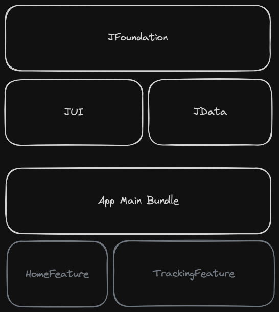

# JKomoot App

```
- The `J` is just a suffix representing an "in-house" solution for something
```

## Decisions

### Setup

- Xcode 13.4.1 (My personal Macbook doesn't support the latest one)
- The minimum iOS version is 15.0 for the main target and packages.

### Frameworks

In order to split the code, responsibilities, and enhance the build time, it is arranged like this:

- JFoundation: Shareable utilities and extensions.
- JUI: Design System and UI code.
- JData: Network integration and data layer.
- App: Main bundle with the main features
    - HomeFeature: simple screen to start tracking
    - TrackingFeature: main screen that shows the streamed images.

It uses the `Swift Package Manager` to manage the local frameworks. It's straightforward usage as it's a native solution.

There is no dependency cycle.



Let's go deeper into them

#### - JData

Package responsible for getting and holding data sources. Therefore, it contains the network layer and models used.

##### Data Sources

The protocol `DataSourceProtocol` defines how the engineer can fetch the data. There is a default implementation `RemoteDataSource`, using the native `URLSession`. Another possible data source may be the one that persists in the disk (cache).

Here, it uses the new framework `Swift Concurrency` to fetch/send data as it's a solid native solution and easy to understand, unlike the callbacks and/or delegates.

To fetch data, you may create a request using the protocol `Requestable`, and then introduce any new API integration. The `FlickrRequest` integrates the Flickr API.

##### Services

It contains the only service needed: `FlickrService`. It uses an instance of `RemoteDataSource` to fetch its search API response and returns an image URL.

It's heavily tested to expect an outcome given a JSON input.

##### Models

For this use case, there are the response model and the photo one, containing the metadata needed to build the image URL.

It's using a `Decodable` solution as it's native and straightforward.

#### - JUI

Package responsible for the app Design System.

It contains the visual tokens, such as colors, fonts, and spacing values.

It also contains the sharable views that the app may use, such as a custom `List` and cell.

There is a `CachedImage` view to wrap the logic for caching images, then, when the user scrolls, the performance gets enhanced.

#### - JFoundation

Package responsible for shareable code and logic that may be used across the app's features.

Besides that, it also holds some extensions and utils code related to anything that may be useful.

##### Router

It contains router logic. It provides the protocol `RouterProtocol` to create the proper router of the feature. The idea is each feature contains its own router and factories the next one.

When the next one is created, this has an instance of parent `RouterDelegate` to delegate actions when needed.

##### Location

It contains logic related to getting the user's location. It contains the default implementation `LocationManager` wrapping the native location manager through a protocol `LocationManagerProtocol`.

It provides two publisher properties `currentStatus` and `currentLocation`. The first may be `authorized`, `denied`, and `requesting`. The second is the current device's location, updated every 100 meters (as defined). It uses reactive programming here as these properties may change often, and the data flow would be more understandable.

Moreover, it provides methods to start and stop tracking.

#### - App

##### Design Pattern

It is under MVVM with a Router.

- Model: Response and model protocols representing the data source.
- View: The views and screens that expect referred view models.
- ViewModel: Bind the model to view. The view models don't know about the views, but they supply the data needed to be rendered. Also, handle the user interactions and call the referred router when needed.
- Router: Handles the navigation and factories the entities needed.

##### Features

- **Home**: A single screen with a simplified pattern. There is a view controller (UIKit with view code) and access to its router. Once the tracking gets started, the router factories the further feature.
- **Tracking**: The main screen. It uses SwiftUI here as it's way easier to implement views and handle data flow (Combine). Moreover, uses the `JUI` views. There is a view model to integrate the `LocationManager` and `FlickrService`, as well as methods to whatever view would bind, i.e., stop tracking.

Long story short, when the view appears, it invokes the view model to bind to location properties. Given the location's status, it shows the proper view state. If the access is authorized, it starts tracking. Every 100 meters, the device's location is updated and a random image is fetched by Flickr service, adding to the current stream on the top, updating the list view.

The list view doesn't need pagination as it may have ~100 images in 2 hours of walking with a ~1.3 m/s, considering an average human being.

Memory management is properly handled and validated. Once the user stops tracking, all the entities related to this feature are successfully deallocated.

In order to receive location updates in the background, the project sets the `Background Mode` capability and the native location manager allows it.

The `TrackingViewModel` is heavily tested to cover many states as it may have different location status and current data.

## Learnings
- Although I've already worked with Location management a long time ago, I had to read more about the newest methods to handle it and don't waste too much device's battery. So I checked out properties like `pausesLocationUpdatesAutomatically` and `activityType`. I found out it must not pause automatically, because if Apple pauses, the user needs to open the app again to resume, and this is not our case (And if it's false, the activity type can be not set). Also, the best accuracy should be the default one: `best`. The sensible flag here is `distanceFilter`, this is the key to saving battery and achieving our use-case, which is set to 100.

- I faked a location path, generating a GPX file and setting it to an iOS simulator as I couldn't test a real case. Please, find `faketrack.gpx` in the project's root.

- I used to use `Kingfisher` or `SDWebImage` libraries to fetch/cache remote images. But, for this scenario, I had to implement an in-house solution, using `AsyncImage` + memory cache.